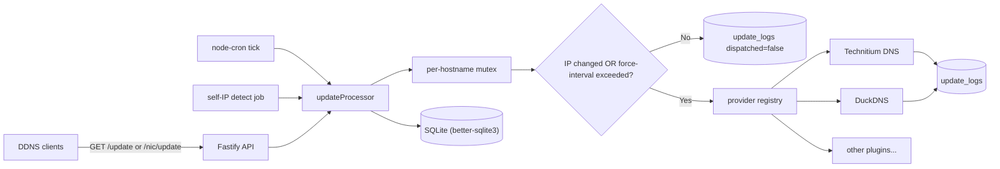

# wm-dynamic-dns

Self-hosted DDNS gateway. It receives IP updates from clients (mobile, Linux
crontab, Windows Task Scheduler, routers...) over a **DuckDNS-compatible** or
**dyndns2-compatible** HTTP endpoint, then dispatches the change to the real
upstream DNS provider you configured (Technitium DNS, DuckDNS, ...) using a
plugin architecture.

It applies sensible **update strategies** out of the box:

- **Skip if unchanged** — caches the last-known IP per hostname; if the new IP
  is identical, the upstream provider is **not** called.
- **Force interval** — even when the IP did not change, push an update once
  per interval (default: 24h) so providers do not expire records.
- **Per-hostname mutex** — a client push and a scheduler tick can never race.

## Features

- Web UI (single admin) for managing providers, hostnames, API tokens, logs,
  schedules, and settings.
- Two public client protocols:
  - `GET /update?token=...&domains=...&ip=auto` — DuckDNS-style.
  - `GET /nic/update?hostname=...&myip=...` with HTTP Basic Auth — dyndns2-style.
- Per-hostname cron schedule (server-side push) in any IANA timezone.
- Optional self-IP detect job: server resolves its own public IP from a chain
  of providers (`ipify`, `ifconfig.co`, `icanhazip`, configurable) with a 60s
  cache and applies it to hostnames flagged `track-self-ip`.
- IPv4 + IPv6 support (A and AAAA records).
- AES-256-GCM encryption of provider credentials at rest.
- Rate limiting on public endpoints.
- Structured JSON logs (pino) with secret redaction.
- Single Docker image: API + SPA + SQLite, ~70 MB.

## Quick start (Docker)

```bash
git clone <this-repo> wm-dynamic-dns
cd wm-dynamic-dns
cp .env.example .env

# Generate strong secrets:
node -e "console.log('JWT_SECRET=' + require('crypto').randomBytes(48).toString('hex'))"
node -e "console.log('APP_ENCRYPTION_KEY=' + require('crypto').randomBytes(32).toString('hex'))"
# Paste both into .env. Set ADMIN_USER and ADMIN_PASS too (or use the first-run
# wizard in the browser instead).

docker compose up -d --build
```

Open http://localhost:8080 and sign in.

## Local dev

Requires Node.js 20+ and pnpm.

**Admin login** (after `cp .env.example .env` and first API boot with an empty DB): username `admin`, password `dev-local-1234`. Same values are in `.env.example` as `ADMIN_USER` / `ADMIN_PASS`. Change the password in Settings for anything beyond your machine.

```bash
pnpm install
cp .env.example .env  # set JWT_SECRET + APP_ENCRYPTION_KEY at minimum

# In two terminals:
pnpm dev:api    # Fastify on :8080
pnpm dev:web    # Vite on :5173 (proxies /api → 8080)
```

Run tests:

```bash
pnpm --filter @wm-ddns/api test
```

## Configuration

All configuration is via environment variables. See [`.env.example`](.env.example).

| Var                        | Default                       | Notes                                                                 |
| -------------------------- | ----------------------------- | --------------------------------------------------------------------- |
| `PORT`                     | `8080`                        |                                                                       |
| `HOST`                     | `0.0.0.0`                     |                                                                       |
| `TRUST_PROXY`              | `false`                       | Set to `true` if behind Caddy/Nginx/Cloudflare so client IP is right. |
| `DATABASE_URL`             | `file:./data/app.db`          | SQLite file path.                                                     |
| `JWT_SECRET`               | required                      | At least 16 chars. Used to sign admin UI sessions.                    |
| `APP_ENCRYPTION_KEY`       | required                      | Exactly 64 hex chars (32 bytes). Used for AES-256-GCM at rest.        |
| `ADMIN_USER` / `ADMIN_PASS`| optional                      | Seed the admin user on first boot. If unset, the UI shows a wizard.   |
| `LOG_LEVEL`                | `info`                        | `fatal` / `error` / `warn` / `info` / `debug` / `trace`.              |
| `CORS_ORIGIN`              | empty                         | Comma-separated origins; leave empty for same-origin only.            |
| `TZ`                       | `UTC`                         | IANA timezone for cron schedules. Set to `Asia/Ho_Chi_Minh` for VN.   |
| `PUBLIC_IP_PROVIDERS`      | ipify,ifconfig.co,icanhazip   | Comma-separated URLs returning plain text IP.                         |
| `SELF_DETECT_INTERVAL_SEC` | `300`                         | `0` to disable.                                                       |

## Client examples

After issuing an API token in the UI:

**Linux crontab** (every 5 minutes):

```cron
*/5 * * * * curl -fsS "https://ddns.example.com/update?token=$WM_TOKEN&domains=home&ip=auto" >/dev/null
```

**Windows Task Scheduler** (one-shot setup):

```powershell
schtasks /Create /SC MINUTE /MO 5 /TN wm-ddns `
  /TR "curl.exe -fsS \"https://ddns.example.com/update?token=$env:WM_TOKEN&domains=home&ip=auto\""
```

**ddclient / Synology DSM / router** (dyndns2 protocol):

```ini
protocol=dyndns2
server=ddns.example.com
login=any
password=<token>
home.example.com
```

## Architecture



## Adding a new DNS provider

Drop a new file at [`apps/api/src/providers/<name>.ts`](apps/api/src/providers)
implementing the `DnsProvider` interface from
[`apps/api/src/providers/types.ts`](apps/api/src/providers/types.ts), then
register it in [`apps/api/src/providers/registry.ts`](apps/api/src/providers/registry.ts).
The web UI auto-renders a config form from the `meta.fields` schema you declare —
no frontend changes required.

## Security notes

- JWT is sent in `Authorization: Bearer ...` (no cookies), so the admin UI does
  not need CSRF tokens. Make sure to serve over HTTPS in production.
- Provider credentials are encrypted with AES-256-GCM before being written to
  SQLite. Rotating `APP_ENCRYPTION_KEY` invalidates all stored configs — avoid
  unless you re-enter them after rotation.
- Public client endpoints are rate-limited (default 60 req/min per token+IP).
- Use a reverse proxy (Caddy / Nginx / Cloudflare Tunnel) for TLS.

## License

MIT.
